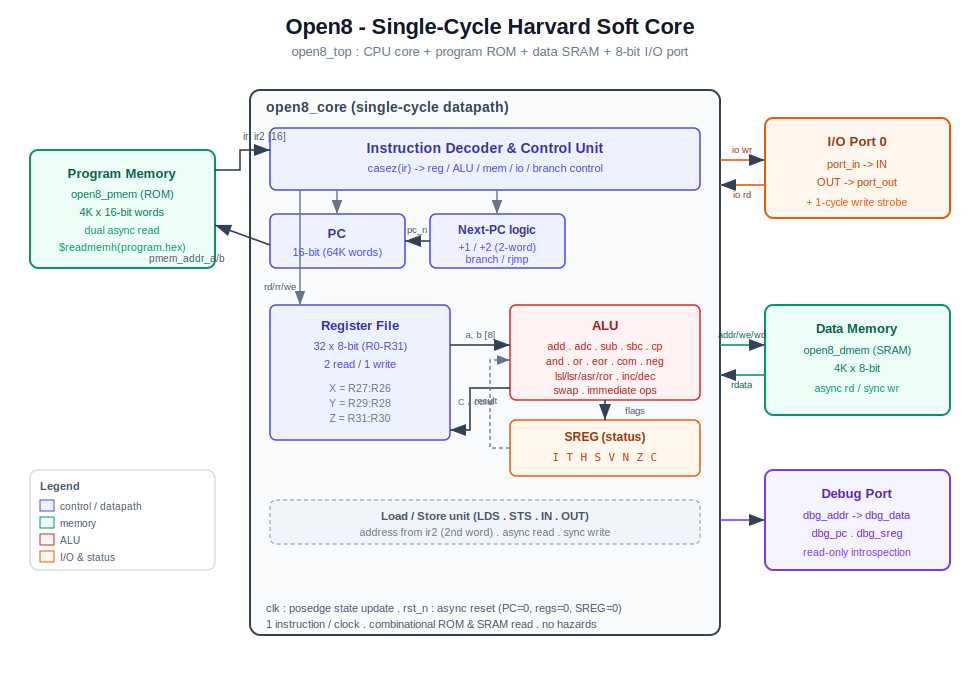

# Open8 Soft Core — Architecture

This document describes the RTL implementation of the **Open8** 8-bit
microcontroller (the AVR-inspired ISA specified in `README.md`,
`register.md`, `instruction.md`, `timer.md` and `interrupt.md`).

The implementation favours **simplicity and clarity** over micro-architectural
sophistication: it is a single-cycle, Harvard-style core meant as a readable
reference and a Verilator test vehicle.

## Block diagram



## Design summary

| Property              | Value                                                        |
|-----------------------|-------------------------------------------------------------|
| Architecture          | Harvard (separate program / data buses)                     |
| Execution model       | Single-cycle — **1 instruction per clock**                  |
| Data width            | 8-bit                                                        |
| Program counter       | 16-bit (64K word space)                                      |
| Registers             | 32 × 8-bit (R0–R31), X/Y/Z 16-bit pairs                      |
| Status register       | `SREG = {I,T,H,S,V,N,Z,C}`                                   |
| Program memory        | 4K × 16-bit ROM, dual asynchronous read                     |
| Data memory           | 4K × 8-bit SRAM, async read / sync write                    |
| I/O                   | one 8-bit port at I/O address 0                              |
| Reset                 | asynchronous, active-low (`rst_n`)                           |

## Module hierarchy

```
open8_top                  (src/open8_top.v)   SoC: glue + I/O + debug
├── open8_core             (src/open8_core.v)  CPU datapath + control
├── open8_pmem             (src/open8_pmem.v)  program ROM (16-bit words)
└── open8_dmem             (src/open8_dmem.v)  data SRAM (8-bit cells)
```

| Module       | Responsibility                                                            |
|--------------|---------------------------------------------------------------------------|
| `open8_top`  | Wires core to memories; decodes I/O port 0; exposes debug + status        |
| `open8_core` | Fetch, decode (`casez`), register file, ALU, flag logic, PC sequencing    |
| `open8_pmem` | Holds the program; two combinational read ports (current + next word)     |
| `open8_dmem` | Byte-addressable scratch RAM for `LDS`/`STS`                              |

## Execution model

Because both memories are **combinational-read**, a complete instruction is
fetched, decoded, executed and committed in a single clock period:

1. **Fetch** — `pmem_addr_a = PC` and `pmem_addr_b = PC+1` are driven
   combinationally, returning the instruction word `ir` (and the following
   word `ir2`, used by two-word instructions).
2. **Decode** — a single `casez(ir)` statement classifies the opcode and
   produces all control signals (register addresses, write-enables, ALU
   operation, memory/I-O strobes, branch decision).
3. **Execute** — the ALU computes the result and the new flags; for `LDS` the
   SRAM read data is already valid (async read), for `STS` the write is queued.
4. **Commit** — on the rising clock edge the register file, `SREG`, `PC` and
   (for stores) the SRAM are updated together.

There is **no pipeline and therefore no hazard logic** — the simplest possible
control. Two-word instructions (`LDS`, `STS`) still complete in one cycle by
reading the second program word through the ROM's second port and advancing
`PC` by 2.

### Next-PC selection

| Instruction class      | Next PC                          |
|------------------------|----------------------------------|
| Most instructions      | `PC + 1`                         |
| `LDS` / `STS`          | `PC + 2`                         |
| `RJMP k`               | `PC + 1 + sext12(k)`             |
| `BREQ/BRNE/BRCS/BRCC`  | taken: `PC + 1 + sext7(k)`       |
| `SLEEP`                | `PC` (frozen; `halted` asserted) |

## Register file & status register

* 32 general-purpose 8-bit registers, two asynchronous read ports and one
  synchronous write port.
* Immediate instructions (`LDI`, `SUBI`, `ORI`, `ANDI`, `CPI`) address only
  `R16..R31`, matching the AVR encoding (`dddd` → `R{16+dddd}`).
* The X/Y/Z 16-bit index pairs are register aliases (`R27:R26`, `R29:R28`,
  `R31:R30`); indirect addressing instructions are **not yet implemented**.

`SREG` bit layout (bit 0 = LSB):

| Bit | 7 | 6 | 5 | 4 | 3 | 2 | 1 | 0 |
|-----|---|---|---|---|---|---|---|---|
| Flag| I | T | H | S | V | N | Z | C |

Flags are computed per the AVR semantics:

* **Add/Sub** update `C Z N V S H`; `V` is two's-complement overflow,
  `S = N ⊕ V`, `H` is the nibble carry.
* **`SBC`/`CPC`** keep `Z` *sticky* (`Z' = Z & (result==0)`).
* **Logic ops** clear `V`, set `N`/`Z`/`S`, leave `C`/`H` unchanged.
* **Shifts** route the shifted-out bit into `C` and recompute `V = N ⊕ C`.

## Memory & I/O map

| Space            | Range            | Access                          |
|------------------|------------------|---------------------------------|
| Program (ROM)    | word 0 … 4095    | fetched by PC; `LPM` not impl.  |
| Data (SRAM)      | byte 0x000 … 0xFFF | `LDS`/`STS` (low 12 addr bits)|
| I/O port 0       | I/O addr `0`     | `IN` reads `port_in`, `OUT` writes `port_out` (+1-cycle `port_out_we` strobe) |

## Implemented instruction subset

Encodings follow the draft in `instruction.md` (which mirrors AVR).

| Group      | Mnemonics                                              |
|------------|-------------------------------------------------------|
| ALU (R,R)  | `ADD ADC SUB SBC AND OR EOR MOV CP CPC`               |
| Immediate  | `LDI SUBI ORI ANDI CPI`                               |
| Unary      | `COM NEG SWAP INC DEC ASR LSR ROR` (`LSL/ROL` = `ADD/ADC Rd,Rd`) |
| Flow       | `RJMP BREQ BRNE BRCS BRCC`                            |
| Memory     | `LDS STS`                                             |
| I/O        | `IN OUT`                                              |
| Control    | `NOP SEI CLI SLEEP`                                   |

Opcode word layout used by the decoder and the assembler (`tools/asm.py`):

| Pattern (16 bits)        | Instruction(s)                                  |
|--------------------------|-------------------------------------------------|
| `0000 11rd dddd rrrr`    | `ADD`                                            |
| `0001 11rd dddd rrrr`    | `ADC`                                            |
| `0001 10rd dddd rrrr`    | `SUB`                                            |
| `0000 10rd dddd rrrr`    | `SBC`                                            |
| `0001 01rd dddd rrrr`    | `CP`                                             |
| `0000 01rd dddd rrrr`    | `CPC`                                            |
| `0010 00rd dddd rrrr`    | `AND`                                            |
| `0010 01rd dddd rrrr`    | `EOR`                                            |
| `0010 10rd dddd rrrr`    | `OR`                                             |
| `0010 11rd dddd rrrr`    | `MOV`                                            |
| `1110 KKKK dddd KKKK`    | `LDI`                                            |
| `0101 KKKK dddd KKKK`    | `SUBI`                                           |
| `0110 KKKK dddd KKKK`    | `ORI`                                            |
| `0111 KKKK dddd KKKK`    | `ANDI`                                           |
| `0011 KKKK dddd KKKK`    | `CPI`                                            |
| `1001 010d dddd 0000/1/2`| `COM`/`NEG`/`SWAP`                               |
| `1001 010d dddd 0011/1010`| `INC`/`DEC`                                     |
| `1001 010d dddd 0101/6/7`| `ASR`/`LSR`/`ROR`                                |
| `1001 000d dddd 0000`+w  | `LDS Rd, k`                                       |
| `1001 001d dddd 0000`+w  | `STS k, Rr`                                       |
| `1011 0AAd dddd AAAA`    | `IN Rd, P`                                        |
| `1011 1AAr rrrr AAAA`    | `OUT P, Rr`                                       |
| `1111 00kk kkkk kbbb`    | `BRBS` (`BREQ` b=1, `BRCS` b=0)                   |
| `1111 01kk kkkk kbbb`    | `BRBC` (`BRNE` b=1, `BRCC` b=0)                   |
| `1100 kkkk kkkk kkkk`    | `RJMP`                                            |
| `1001 0101 1000 1000`    | `SLEEP`                                           |
| `1001 0100 0/1111 1000`  | `SEI` / `CLI`                                     |
| `0000 0000 0000 0000`    | `NOP`                                             |

## Debug & verification

* A **read-only debug port** (`dbg_addr → dbg_data`, plus `dbg_pc`,
  `dbg_sreg`) lets the C++ testbench inspect any register and processor state
  without depending on Verilator-internal symbol names.
* `tools/asm.py` is a two-pass assembler that turns the selected example
  (e.g. `example/program/program.s` or `example/blink/blink.s`) into the
  `$readmemh` image `program.hex` at the project root.
* `tb/sim_main.cpp` clocks the core until `halted`, checks register / flag /
  port results, and writes a `open8.vcd` waveform.

```
make                    # assemble + verilate + build + run (writes open8.vcd)
make hex                # re-assemble the selected example (EXAMPLE=...) into program.hex
make EXAMPLE=blink hex  # select a different example under example/
make wave               # run then open the VCD in gtkwave
make clean              # remove build artifacts
```

## Limitations & roadmap

The current core is intentionally minimal. Features from the Open8 spec that
are **not yet implemented**:

* Stack & subroutines: `PUSH`/`POP`/`CALL`/`RET`/`RCALL` and the stack pointer.
* Indirect addressing through X/Y/Z (`LD`/`ST`, pre-dec / post-inc, `LPM`).
* Interrupt subsystem (`interrupt.md`): IVT, `RETI`, `INTF`/`INTE`, context save.
* Timers / counters and PWM (`timer.md`).
* `MUL`, multi-word `JMP`/`CALL`, and the EEPROM / power-management modes.

Natural next step: add the stack + interrupt path, then a Timer0 peripheral
driving a compare-match interrupt — which together exercise most of the
remaining spec.
